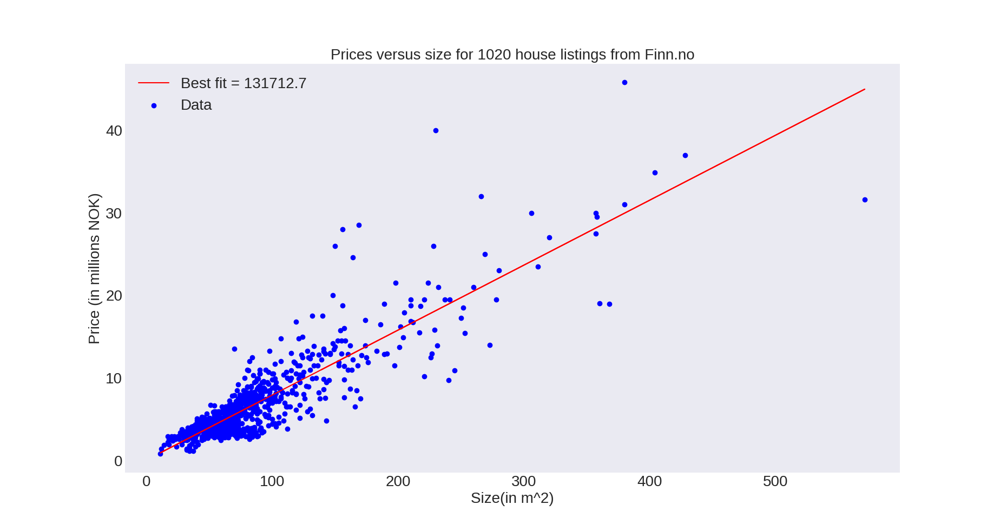

## A simple webscraper, scraping house listings from Finn.no and saving to csv (scraper.py). Reading, cleaning and plotting (analysis.py)

## Built With

- [BeautifulSoup](https://www.crummy.com/software/BeautifulSoup/bs4/doc/)
- [Matplotlib](https://matplotlib.org/)

